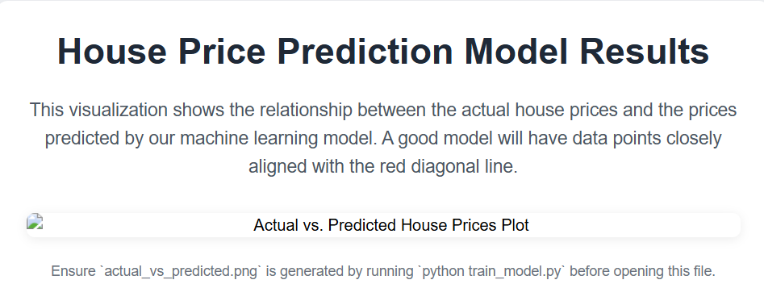

# house-price-prediction
Predictive Analysis using Machine Learning

 # House Price Prediction ML Project

This project demonstrates a basic machine learning pipeline for predicting house prices. It covers data generation (or loading), preprocessing, model training, evaluation, and making new predictions.

## Features

* **Synthetic Data Generation**: Creates a sample dataset of house features and prices for demonstration.
* **Data Preprocessing**: Handles numerical scaling and categorical encoding using `scikit-learn` pipelines.
* **Linear Regression Model**: Trains a simple linear regression model to predict prices.
* **Model Evaluation**: Calculates common metrics like Mean Squared Error (MSE), Root Mean Squared Error (RMSE), and R-squared (R2).
* **Model Persistence**: Saves the trained model for future use without retraining.
* **Prediction**: Loads the saved model to predict prices for new house data.
* **Basic Visualizations**: Plots actual vs. predicted prices and residual distribution.

## Model Performance Visualization

Here's a visualization showing the actual house prices against the prices predicted by our model. Ideally, points should fall close to the red regression line.



Alternatively, you can view the `actual_vs_predicted.png` image directly in your browser by opening the `output_visualization.html` file after training the model.

## Getting Started

Follow these steps to set up and run the project locally.

### Prerequisites

* Python 3.8+
* `pip` (Python package installer)

### Installation

1.  **Clone the repository (or download the files):**
    ```bash
    git clone https://github.com/YOUR_USERNAME/house-price-prediction.git
cd house-price-prediction
    ```
    *(Note: Replace `YOUR_USERNAME` with your actual GitHub username and adjust the repo name if it's different)*

2.  **Create a virtual environment (recommended):**
    ```bash
    python -m venv venv
    ```

3.  **Activate the virtual environment:**
    * **On Windows:**
        ```bash
        .\venv\Scripts\activate
        ```
    * **On macOS/Linux:**
        ```bash
        source venv/bin/activate
        ```

4.  **Install the required packages:**
    ```bash
    pip install -r requirements.txt
    ```

### How to Run

1.  **Generate the dataset:**
    This script creates `house_data.csv` in the project root.
    ```bash
    python data_generator.py
    ```

2.  **Train the model:**
    This script preprocesses the data, trains the model, evaluates it, generates plots (including `actual_vs_predicted.png`), and saves the trained model as `house_price_model.pkl`.
    ```bash
    python train_model.py
    ```

3.  **Make predictions:**
    This script loads the saved model and uses it to predict prices for sample new house data.
    ```bash
    python predict_price.py
    ```

## Project Structure

house-price-prediction/
├── README.md
├── requirements.txt
├── data_generator.py
├── train_model.py
├── predict_price.py
├── house_data.csv        # Generated by data_generator.py
├── house_price_model.pkl # Generated by train_model.py
├── actual_vs_predicted.png # Generated by train_model.py for README
└── output_visualization.html # NEW: HTML file to display the output plot

## Dependencies

All dependencies are listed in `requirements.txt`.

## Future Enhancements

* **Real Dataset**: Integrate with a real-world house price dataset (e.g., from Kaggle).
* **More Models**: Experiment with other regression algorithms (e.g., Random Forest, Gradient Boosting, XGBoost).
* **Feature Engineering**: Create more informative features from existing ones (e.g., age of house).
* **Hyperparameter Tuning**: Optimize model performance using techniques like Grid Search or Random Search.
* **Web Application**: Build a simple web interface (e.g., using Flask or FastAPI) to allow users to input house features and get predictions.
